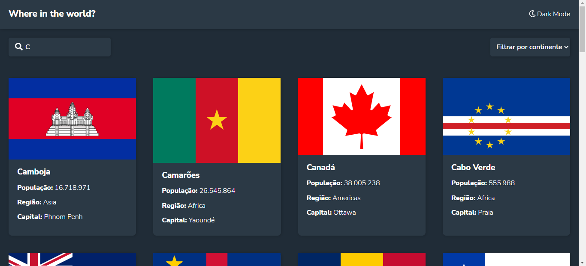

# App Rest Countries Api

## App to show country information. Layout from Frontend Mentor

#### Developed by Alex Maia 🚀

<h1 align="center">   </h1>

### Resources used:

- [Vue Js](https://vuejs.org)
- [Vue Router](https://router.vuejs.org)
- [Font Awesome](https://fontawesome.com/)


## Project setup

```

npm install

```

  

### Compiles and hot-reloads for development

```

npm run serve

```

  

### Compiles and minifies for production
```

npm run build

```

### Lints and fixes files

```

npm run lint

```

### Customize configuration

See [Configuration Reference](https://cli.vuejs.org/config/).